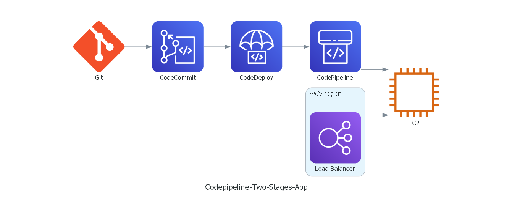

<h2 align="center"><u>Two-stages-aws-codepipeline</u></h2>


<h4 align="center"> Deploy Two Stages AWS CodePipeline </h4>

<p align="center">
<br>
</p>

### [+] Description
This project demonstrates how to set up a two-stage AWS CodePipeline to automate the continuous delivery of a simple application to an EC2 instance. The pipeline utilizes AWS CodeCommit for source control, AWS CodeDeploy for deployment, and integrates seamlessly with Git for version control. IAM roles ensure secure management of resources, and an Elastic Load Balancer distributes traffic to the EC2 instance.

##### Get Started
------------
**Create a Repository in CodeCommit ->**
+ Sign in to the AWS Management Console.
+ Navigate to CodeCommit.
+ Create a new repository and name it appropriately.

**Setup SSH Key for CodeCommit ->**
+ Generate an SSH key if you don't already have one:
```ssh-keygen```
+ Copy the public key to CodeCommit:
    - Navigate to your IAM user settings.
    - Under "SSH keys for AWS CodeCommit," add the generated public key.

**Clone the repository ->**
+ cmd:   ```git clone https://github.com/omarsamyi/two-stages-aws-codepipeline.git```
+ push the repository to CodeCommit
    - cmd: ```git add -A ```
    - cmd: ```git commit -m "Initial commit of sample application" ```
    - cmd: ```git push origin main  ```
  
**Create IAM Roles and Policies ->**
+ Create an EC2 Role:
    - Go to IAM in the AWS Management Console.
    - Create a role with the following permissions: `AmazonEC2RoleforAWSCodeDeploy`, `AmazonSSMManagedInstanceCore`.
+ Create a CodeDeploy Role:
   - Create another role for CodeDeploy with the `AWSCodeDeployRole` policy.

**Launch EC2 Instance ->**
+ Go to the EC2 dashboard and launch a new instance.
+ Configure security group settings:
   - Open port 22 for SSH access.
   - Open port 80 for HTTP access.
+ In advanced settings, select the IAM instance profile created for the EC2 role.

**Setup CodeDeploy ->**
+ Navigate to the CodeDeploy console.
+ Create a new application.
+ Create a new deployment group with the following settings:
    - Environment: Select EC2 instances.
    - Key: Value pairs for identifying the instances.

**Create a CodePipeline ->**
+ Go to the CodePipeline console.
+ Create a new pipeline.
+ Configure the source stage to use your CodeCommit repository.
+ Add a deploy stage to use CodeDeploy with the application and deployment group you created earlier.

By following these steps, you will set up a fully functional CI/CD pipeline using AWS services.

### [+] Find me on 
<a href="https://m.me/https://www.linkedin.com/in/omarsamyi/" target="_blank"></a>

